# Applied Deep Learning 2024WS Project Proposal

Topic: *Image Classification*

Project Type: *Bring your own data*

## Project idea and approach

**Multi-label classification of image artifacts in hemispherical sky images.** The images come from a dataset of approximately 10,000 images collected from my all-sky camera prototype during my master's thesis. I am at the end of this thesis, which aims to provide the most accurate possible estimation of diffuse sky radiation per pixel from hemispherical sky images for solar energy applications. Unfortunately, image artifacts such as dirt on the optics, dew, and similar issues cause incorrect radiation estimates, but many of them can be corrected by cleaning the optics. Further, I need to distinguish clear-sky from clouded-sky images, as the clear-sky ones will be used for radiometric calibration of the camera. Because the camera is built from a Raspberry Pi 4, it is possible to use a neural network directly on the camera hardware. To allow on-demand maintenance of the camera capturing these images, I would like to work on classifying these artifacts directly on the device.

My goal for this project is to label at least half of the dataset (~5.000 images) and train an image classifier that runs on the Raspberry Pi 4 and can classify a sky image in no more than a few seconds. Up to four labels should be possible simultaneously for a sky image: clouds, soiling, water droplets inside (from dew), and water droplets outside (from rain). This could enable me to make a shift from regular to on-demand maintenance of the camera and provides me with the opportunity to get more hands-on experience with deep learning.

Looking into the literature, I found two recent papers that will be relevant for my project. They address the challenges of deploying deep learning models on resource-limited devices like the Raspberry Pi, which is the core of the camera prototype. The first paper presents TripleNet, a lightweight convolutional neural network designed specifically for efficient image classification on the Raspberry Pi, showing the potential for milli-second inference time and below 100 MB memory usage (1). The second paper focuses on the real-time classification of sky conditions using deep learning and edge computing, aligning directly with my project's aim of automating the detection of artifacts in hemispherical sky images. It demonstrates the feasibility of automating sky image analysis on low-cost hardware (2).

## Dataset

The dataset consists of 9755 daytime hemispherical sky images collected from May to October 2024 with two all-sky camera prototypes in Vienna, Austrian and Sophia Antipolis, France. An example of such an image, without artifacts, taken on 23.08.2024 at 11:30 in Sophia Antipolis can be seen below.

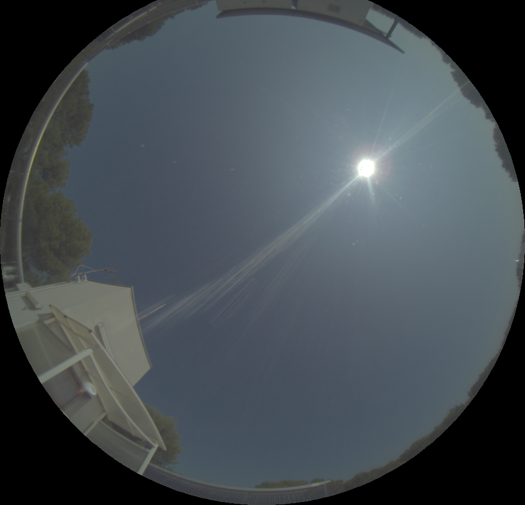

Each image is fused from the original raw capture of five increasing exposures into one high dynamic range image (HDR) to avoid overexposed pixels from the bright sunlight and capture details in clouds at the same time. The images from one camera have a resolution of 884x850 pixels and 892x864 pixels from the other camera. Below are examples for each of the five classes that we want to detect: **clear sky**, **clouds**, **soiling**, **water droplets inside** (from dew), and **water droplets outside** (from rain).

| Clear Sky | Clouds | Soiling | Water droplets inside | Water droplets outside |
|-----------|--------|---------|-----------------------|------------------------|
| | 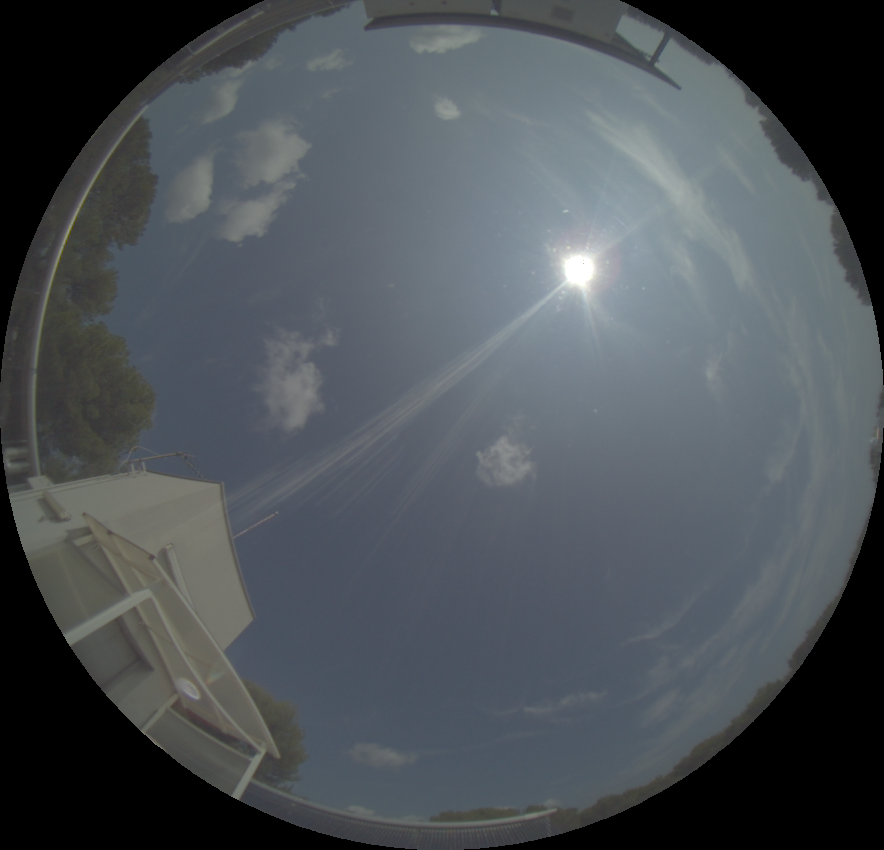 | 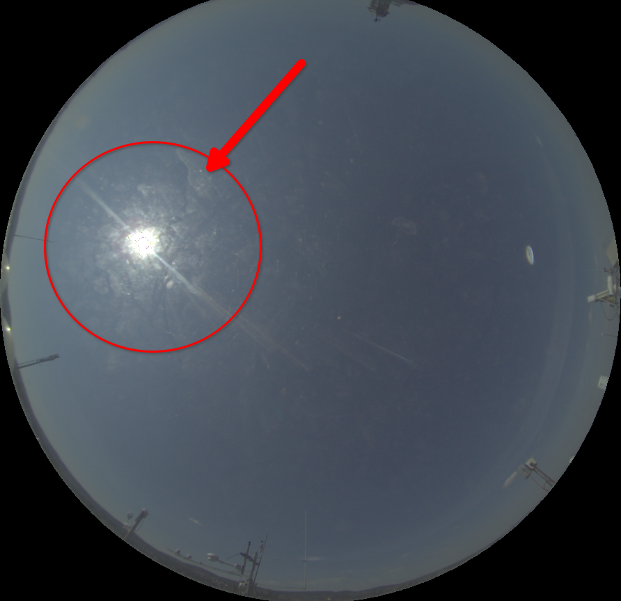 | 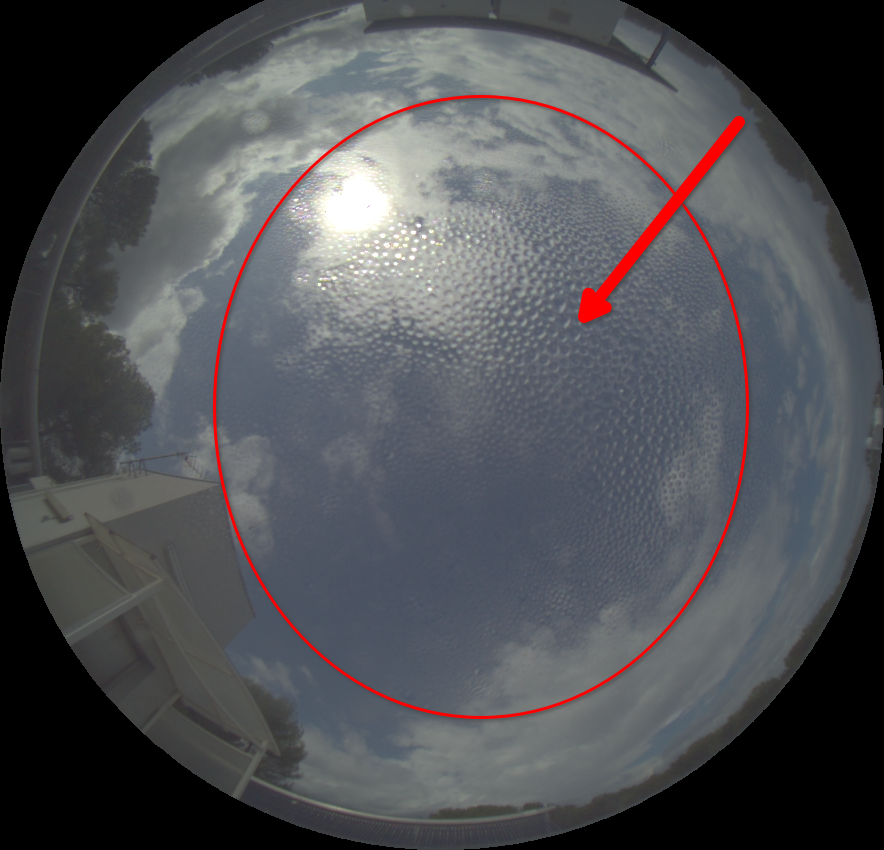 | 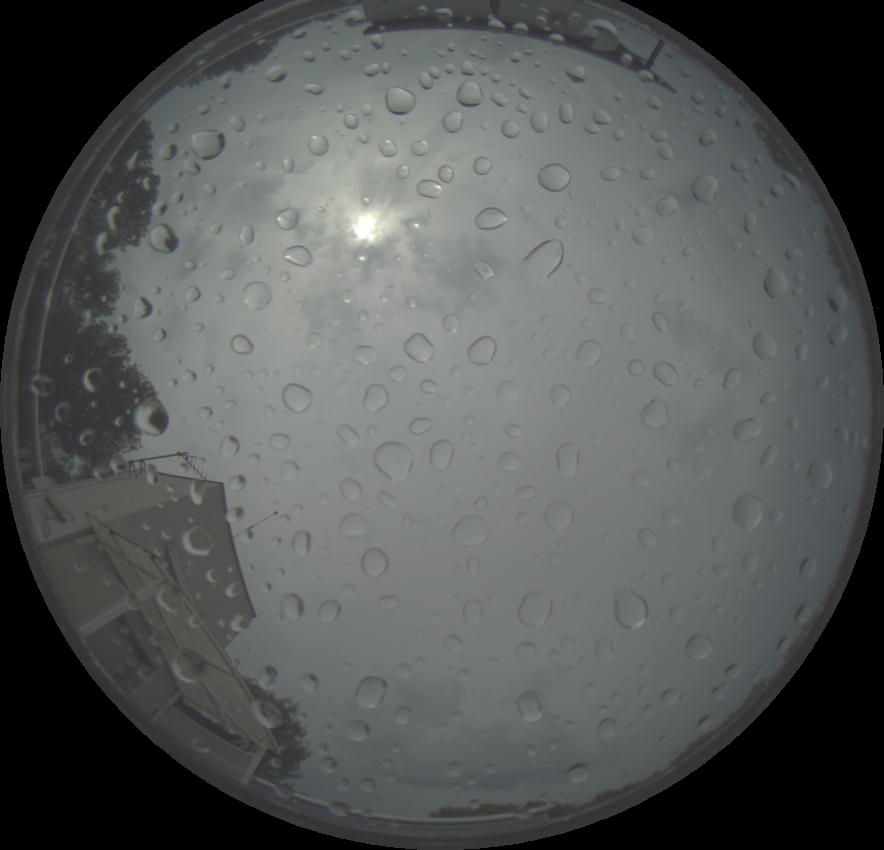 |
| Clear sky. Mutually exclusive with *Clouds* class. | Clouds are visible in the sky. Mutually exclusive with *Clear Sky* class. | Dirt on the dome protecting the lens is visible, mostly by reflection around the sun, but also in other areas of the dome. | Water droplets from dew inside of the dome protecting the lens are visible. | Water droplets outside from rain on the dome protecting the lens are visible. |

Looking at the third and fourth images we can see that the classes can overlap (clouds can be present with rain or dew). This is why we need a multi-label classification approach.

## Work-breakdown Structure (85-95 hours)

### Dataset Collection (25-35 hours)

- Collecting and preprocessing the images, including merging exposures into HDR images and rescaling to common resolution: **5 hours**
- Manual labeling of the dataset (at least ~5,000 images) using CVAT (3) into four classes: **20-30 hours**

### Designing, Building and Training the Network (25 hours)

- Adapt TripleNet [1] for multi-label classification (currently set up fro single label classification on CIFAR10): **10 hours**
- Train the model and experiment with different hyperparameters (not including actual training time): **15 hours**

### Building the Application (15 hours)

- Test the model on the Raspberry Pi 4 for performance (accuracy and speed): **5 hours**
- Develop a basic web interface for uploading and classifying images on the Raspberry Pi 4: **10 hours**

### Writing the Final Report and Preparing the Presentation (20 hours)

- Creating the report and with proposal, methodology, results, and insights: **10 hours**
- Preparing the presentation, recording, and uploading it: **10 hours**

## References

(1) Efficient convolutional neural networks on Raspberry Pi for image classification ([DOI: 10.1007/s11554-023-01271-1](https://doi.org/10.1007/s11554-023-01271-1))

(2) Real-Time Automatic Cloud Detection Using a Low-Cost Sky Camera ([DOI 10.3390/rs12091382](https://doi.org/10.3390/rs12091382))

(3) CVAT: Computer Vision Annotation Tool ([CVAT on GitHub](https://github.com/cvat-ai/cvat))

---

## Update 2024-10-29

- Created a dataset by merging raw exposures into HDR images. They amount to 9780 images.
- Created a custom PyTorch dataset class [SkyImageMultiLabelDataset](./src/dataset.py).
- Successfully followed pytorch guide on [Real Time Inference on Raspberry Pi 4](https://pytorch.org/tutorials/intermediate/realtime_rpi.html) to test running a MobileNetV3 model on the Raspberry Pi 4.
- Decided to use the MobileNetV3 model as a starting point for the project, instead of TripleNet. Reasons: weights for MobileNetV3 are available in PyTorch, but not for TripleNet; MobileNetV3 expects an input size of 224x224, which is closer to the resolution of the images in the dataset, while TripleNet expects 32x32 images.

## Update 2024-11-20

- 4026 (41%) images are labeled, 5700 (58%) images are left to label.
- 54 (1%) images have been excluded from the dataset, because they include people or other objects (spiders, birds, etc.) or they are of poor quality due to high noise.
- A first version of a multi-label classifier based on MobileNetV3 has been fine-tuned on the labeled images. The results are promising, but the model is not yet generalizing well to unseen images.

**Random sample of labeled images**:

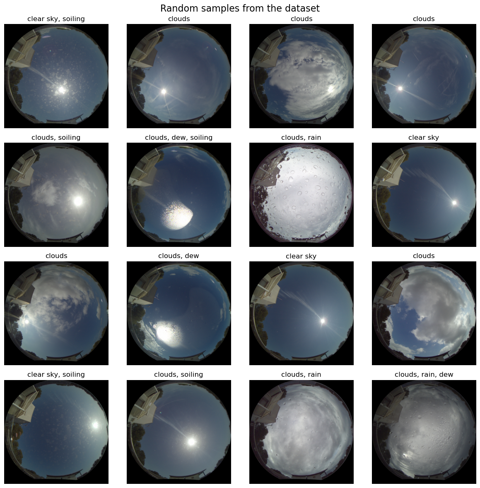

**Random sample of excluded images**:

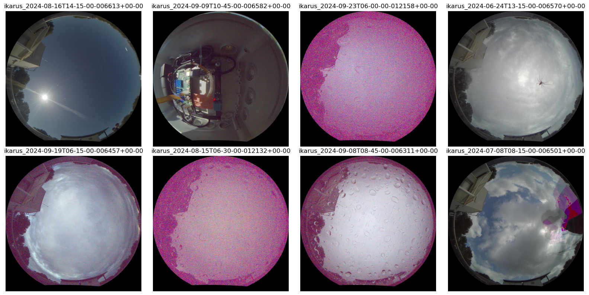

## Update 2024-11-21

- First useful version of the model is trained and saved in [./data/training-runs/mobilenetv3_20241120-195102+0100/best_model.pth](./data/training-runs/mobilenetv3_20241120-195102+0100/best_model.pth).
- Training was done with fine-tuning the MobileNetV3Large model and using data augmentation.
- Training was done on 3222 images, validated on 402 images. Test set not yet used.
- Training time was around 2h40m on my laptop's NVIDIA GeForce MX150.
- The model achieves on the validation set a subset accuracy of 89% and a mean Jaccard score of 94%, with a macro averaged precision of 95% and recall of 93% over all five classes.
- Added basic webapp to classify images using the trained model. The webapp is available in [./src/webapp/](./src/webapp/).

**Example of model output on unseen images**:

| Image | Prediciton|
| --- | --- |
| 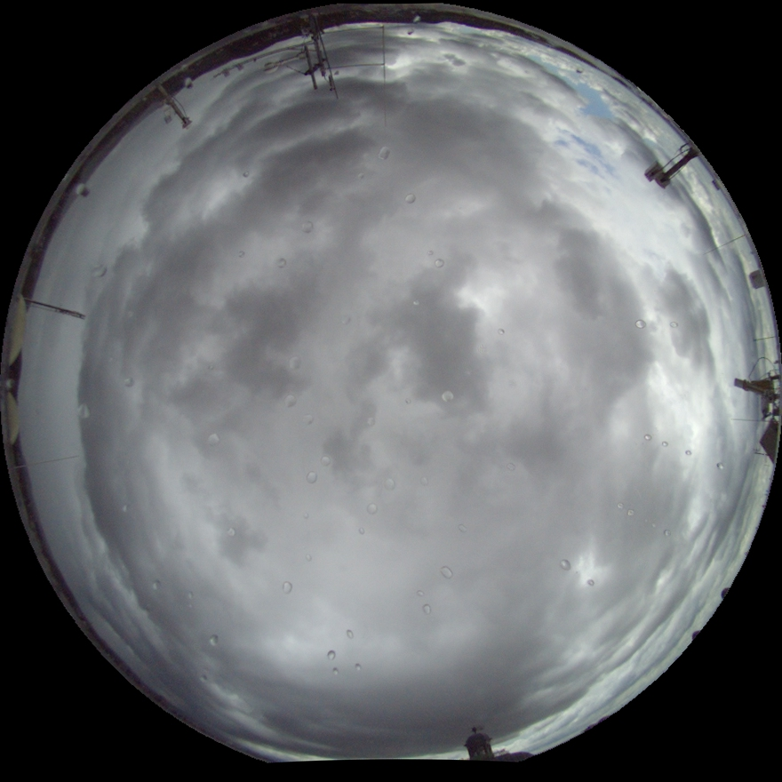 | `clouds: 1.00 rain: 0.93 soiling: 0.36 dew: 0.32 clear sky: 0.00` |
| 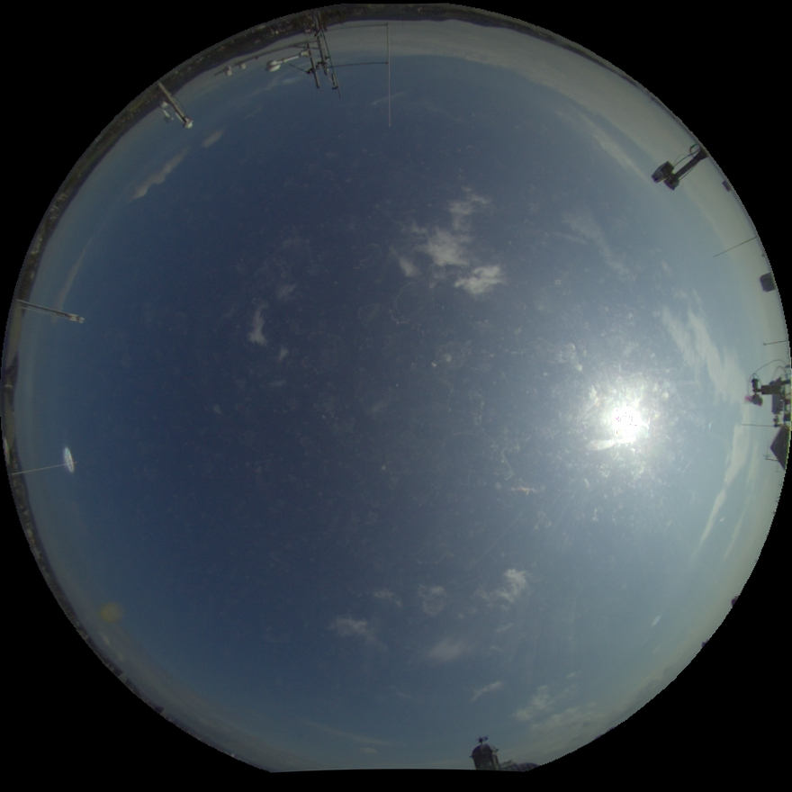 | `clouds: 1.00 dew: 0.98 soiling: 0.70 rain: 0.00 clear sky: 0.00` |
| 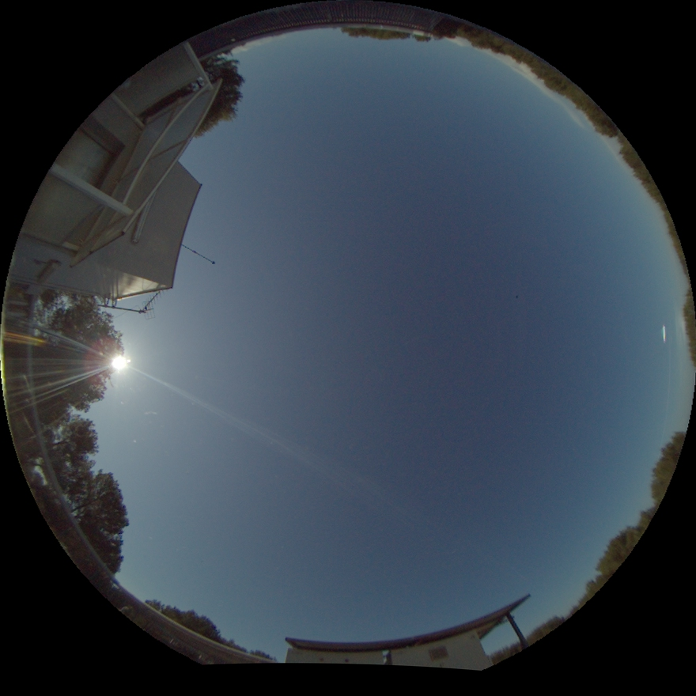 | `clear sky: 0.99 clouds: 0.01 soiling: 0.00 dew: 0.00 rain: 0.00` |

**Screenshots of the webapp**:

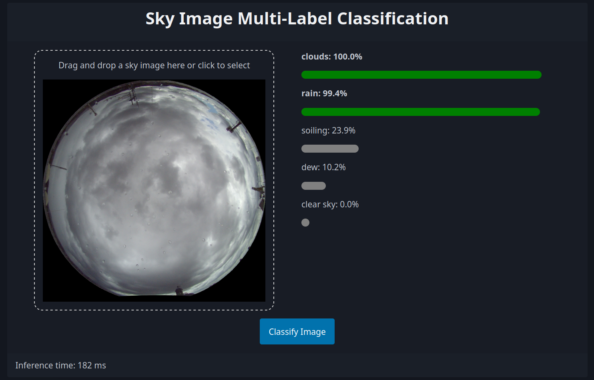
